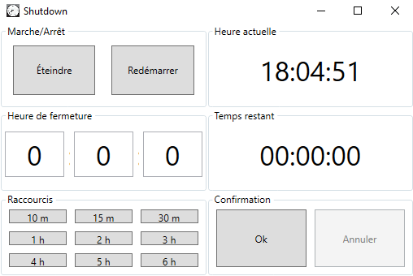

# Shutdown

Shutdown is a software that allows to automate the shutdown of the PC. Its start-up is particularly simple, as well as its configuration.

It has a simple and effective interface.

## Downloads

Download [Shutdown](https://github.com/benliev/Shutdown/releases/download/1.0.0/Shutdown_1.0.0_win.zip), then, unzip file and execute setup.exe.